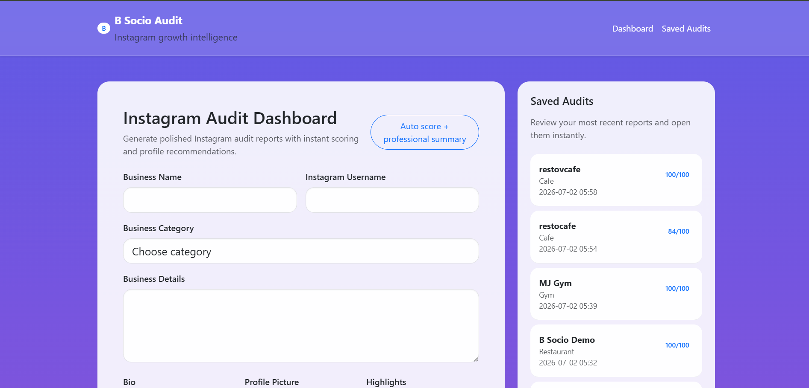
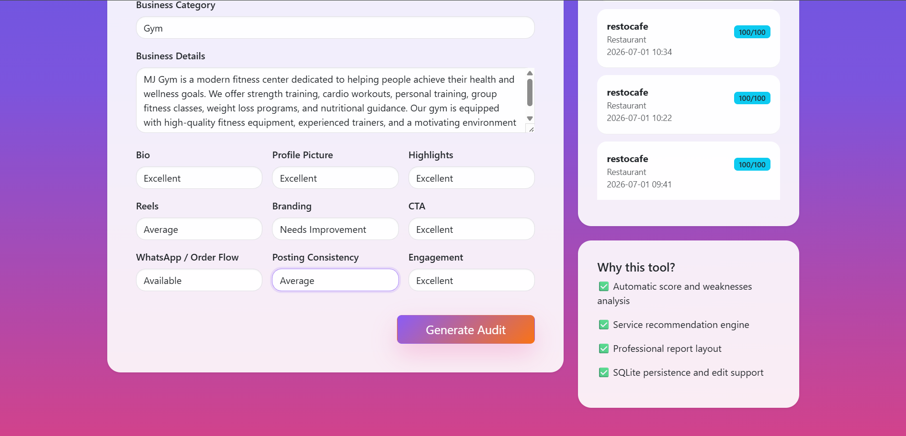

# B Socio Instagram Audit Tool

[](https://github.com/sera-mary/instagram_audit_tool/actions/workflows/python-app.yml)

## Project Overview

The B Socio Instagram Audit Tool is a Flask-based web application that helps evaluate an Instagram business profile. Users can enter business details, assess different profile elements, and generate a professional audit report with an overall score and recommendations.

---

## Features

- Business Information Form
- Instagram Profile Evaluation
- Business Category Selection
- Audit Score (0–100)
- Overall Rating
- Improvement Areas
- Suggestions
- Recommended B Socio Services
- Audit Summary
- Copy-Ready Client Message
- Clean and Responsive User Interface

---

## Technologies Used

- Python
- Flask
- HTML5
- CSS3

---

## Project Structure

```
instagram_audit_tool2/
│
├── app.py
├── requirements.txt
├── README.md
├── .gitignore
│
├── static/
│   └── style.css
│
├── templates/
│   ├── index.html
│   └── result.html
```

---

## Installation

1. Clone the repository

```
git clone <repository-link>
```

2. Open the project folder

3. Install dependencies

```
pip install -r requirements.txt
```

4. Run the application

```
py app.py
```

5. Open your browser

```
http://127.0.0.1:5000
```

---
## Screenshots

### Home Page



### Filled Form



### Audit Report (Top)


### Audit Report (Middle)


### Audit Report (Bottom)


## Sample Workflow

1. Enter Business Name
2. Enter Instagram Username
3. Select Business Category
4. Enter Business Details
5. Add Weak Points
6. Add Suggestions
7. Select Profile Ratings
8. Click **Generate Audit**
9. View the generated report

---

## Future Improvements

- PDF Report Export
- AI-powered Audit Suggestions
- Dashboard Analytics
- Instagram API Integration

---

## Author

Developed by Sera Mary Thomas