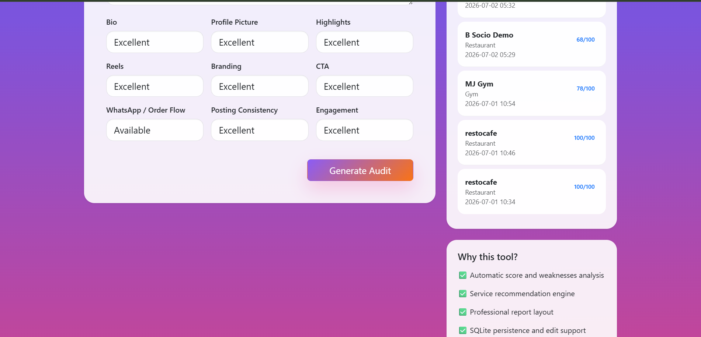
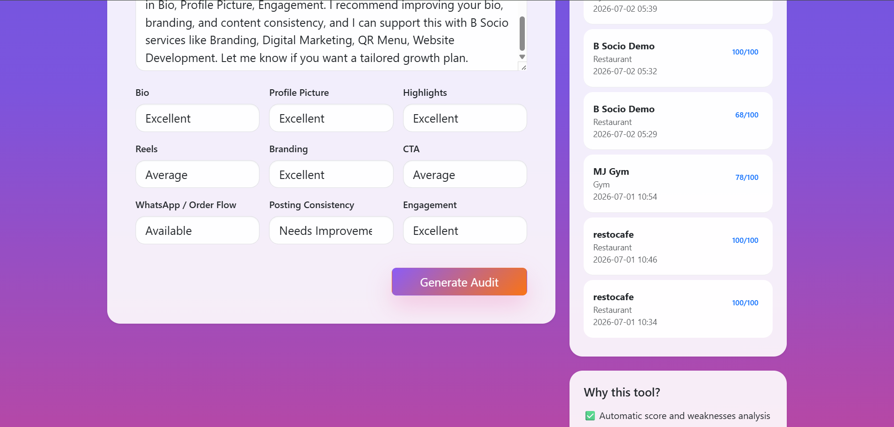
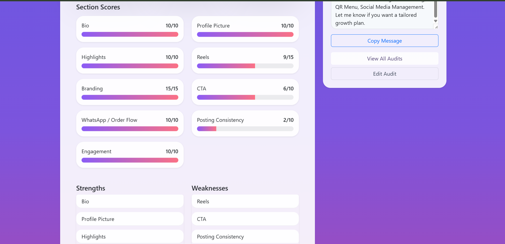
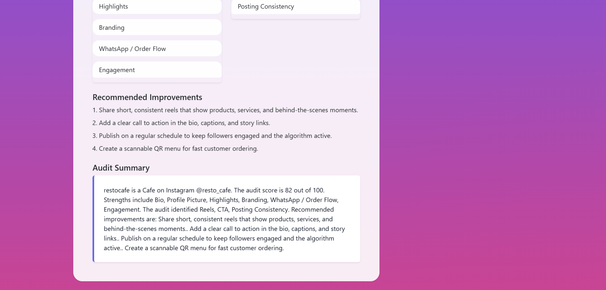

# B Socio Instagram Audit Tool

## Project Overview

The B Socio Instagram Audit Tool is a Flask web app for reviewing Instagram business profiles. It collects business and profile details, calculates a score out of 100, and generates a professional audit report with service recommendations and a copy-ready client message.

## What the app does

- Collects business name, Instagram handle, category, and profile context
- Scores profile strength across bio, visuals, content, branding, CTA, order flow, consistency, and engagement
- Generates a polished report with strengths, weaknesses, recommendations, and suggested B Socio services
- Saves audits in a SQLite database and lets users view, edit, and delete previous reports

## Tech stack

- Python
- Flask
- Flask-WTF
- WTForms
- Flask-SQLAlchemy
- SQLite
- Bootstrap

## Project structure

```text
instagram_audit_tool2/
├── app.py
├── audit_utils.py
├── config.py
├── forms.py
├── models.py
├── requirements.txt
├── static/
│   └── style.css
├── templates/
│   ├── index.html
│   ├── result.html
│   ├── edit.html
│   └── layout.html
└── Screenshots/
```

## Installation

1. Clone the repository
2. Create and activate a virtual environment
3. Install the dependencies

```bash
pip install -r requirements.txt
```

4. Run the app

```bash
python app.py
```

5. Open the app in your browser at http://127.0.0.1:5000

## Screenshots

The current app includes the following working workflow screenshots:

## Screenshots

### Home Page


### Home Page (Filled Form)


### Filled Form


### Filled Form 2


### Result


### Result 2


### Result 3


## Sample workflow

1. Enter the business name and Instagram username
2. Select a category and describe the business
3. Rate the profile elements in the form
4. Click Generate Audit
5. Review the score out of 100, recommendations, and the copy-ready DM

## Author

Developed by Sera Mary Thomas